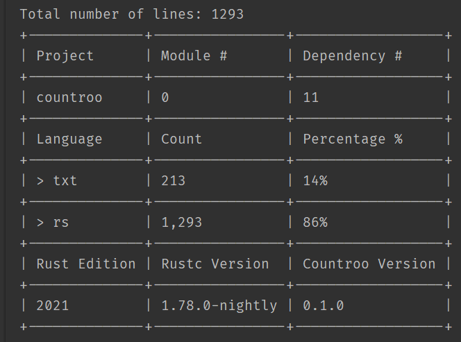

# CountRoo 🦘👀

Welcome to the wild world of `CountRoo`, your go-to Rust crate for navigating the vast wilderness of your codebase!  

🌲🔭 Whether you're tracking down every line of Rust code, or just curious about your project's stats.  

Or simply want to know the contribution ratio of each language `CountRoo` hops right to it, giving you the insights you need with a side of fun. 🎉





> This **README** is generated by **ChatGPT** & not the crate's author, just because I'm lazy.

## Quick Start 🚀

Adding `CountRoo` to your Rust project is easier than spotting a koala in a eucalyptus tree! Here’s how you can get started:

1. **Add CountRoo to your Cargo.toml** 📄

    ```toml
    [build-dependencies]
    countroo = { version = "0.1.3", features = ["default"]}
    ```

2. **Create or Update Your build.rs** 🛠️

   Ensure your project has a `build.rs` file in the root (right next to `Cargo.toml`). If it's missing, now's the time to add it!

3. **Invoke CountRoo with Magic Macros** ✨

   Inside your `build.rs`, let `CountRoo` work its magic by using its provided macros to analyze your project:

    ```rust
    fn main() {
        countroo::count_it_all!();
        // Or for the adventurous:
        // countroo::count_some!();
        // If you're using it for a workspace, you can just use it like this inside any project's build.rs
        countroo::count_it_all!(workspace: true);
    }
    ```

## Features at a Glance 🌟

`CountRoo` isn't your average crate; it’s packed with features that make code analysis both insightful and delightful:

- **Lines of Code Counter** 📊: Discover how many lines of code your project spans, with options to include or exclude empty lines.

- **Config Flexibility** 📑: Supports a variety of config formats including TOML, JSON, YAML, XML, and even simple newline-separated configs, although for the initial release they will not be available.

- **Parallel Processing** ⚡: Utilizes `rayon` for speedy analysis, because who likes waiting?

- **Customizable and Extensible** 🛠️: Tailor `CountRoo` to your needs by specifying which file extensions to include in the count.

## Example Macro Usage 📝

Want to quickly count all lines of code? Just use the `count_it_all!` macro in your `build.rs`. For a more selective count, the `count_some!` macro is your friend. Here’s a peek at how it’s done:

```rust
fn main() {
    // To count everything:
    countroo::count_it_all!();
    
    // Feeling selective?
    countroo::count_some!();
}
```

## Dive Deeper 🤿

`CountRoo` comes with comprehensive documentation for those looking to explore its full potential. From handling custom errors to deep-diving into configurations, it’s all there at your fingertips.

## Wrapping Up 🎁

So, what's the hold-up? Let `CountRoo` take you on a code counting adventure. Discover the hidden treasures within your codebase and maybe, just maybe, find out it’s bigger (or smaller) than you thought. Happy coding, Rustaceans! 🦀🎉
